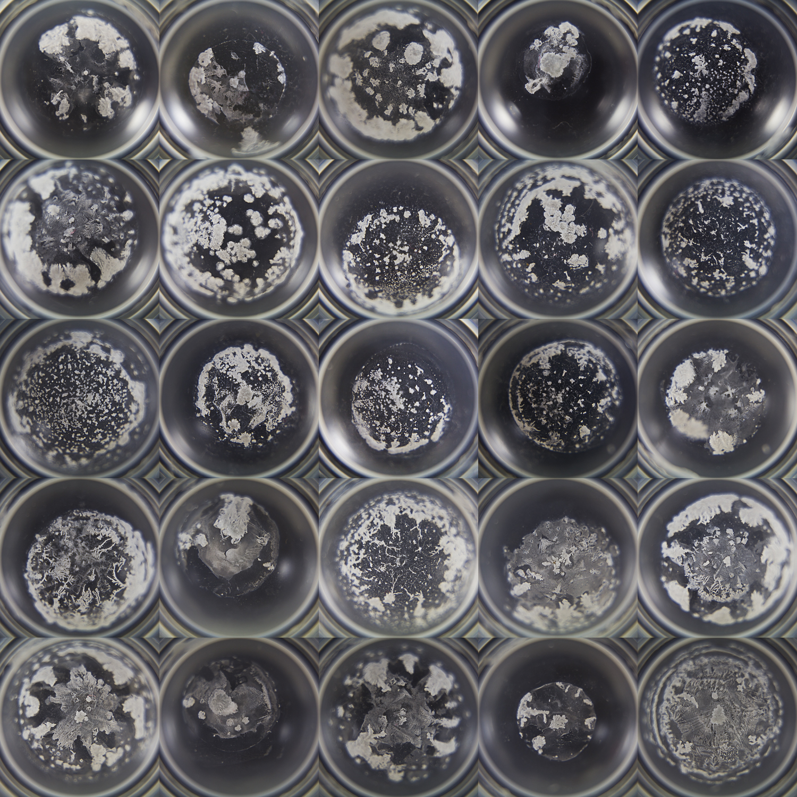

	<h1>
	Acuvue Oasys
	</h1>
	

		

			
			<h2 class="title">Acuvue Oasys</h2>
			<h3>
			I have a -6.00 prescription, technically myopic, which allows me to briefly
			see these patterns on yesterday's dried contacts container before I put today's contacts in my eyes.</h3>
		

	

