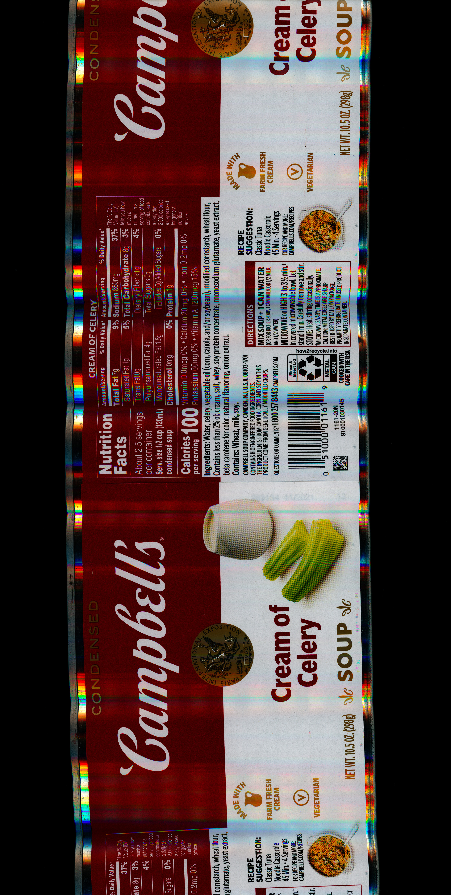
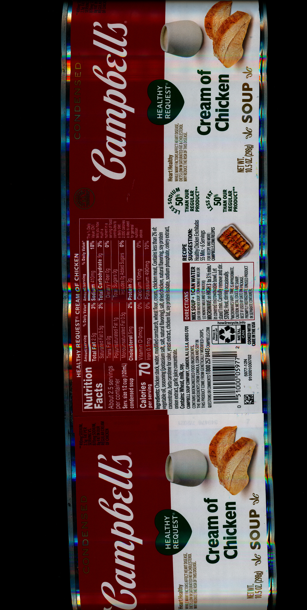

	

		

			
			<h2 class="title">
			<a href="javascript:void(0);" name="#asparagus">Asparagus</a>
			</h2>
		

		

			
			<h2 class="title">
			<a href="javascript:void(0);" name="#cheddarcheese">Cheddar Cheese</a>
			</h2>
		

		

			
			<h2 class="title">
			<a href="javascript:void(0);" name="#chickennoodle">Chicken Noodle</a>
			</h2>
		

		

			
			<h2 class="title">
			<a href="javascript:void(0);" name="#consume">Consume</a>
			</h2>
		

		

			
			<h2 class="title">
			<a href="javascript:void(0);" name="#creamofcelery">Cream of Celery</a>
			</h2>
		

		

			
			<h2 class="title">
			<a href="javascript:void(0);" name="#creamofchicken">Cream of Chicken</a>
			</h2>
		

		

			
			<h2 class="title">
			<a href="javascript:void(0);" name="#creamofmushroom">Cream of Mushroom</a>
			</h2>
		

		

			
			<h2 class="title">
			<a href="javascript:void(0);" name="#creamofpotato">Cream of Potato</a>
			</h2>
		

		

			
			<h2 class="title">
			<a href="javascript:void(0);" name="#frenchononion">French Onion</a>
			</h2>
		

		

			
			<h2 class="title">
			<a href="javascript:void(0);" name="#tomato">Tomato</a>
			</h2>
		

	

