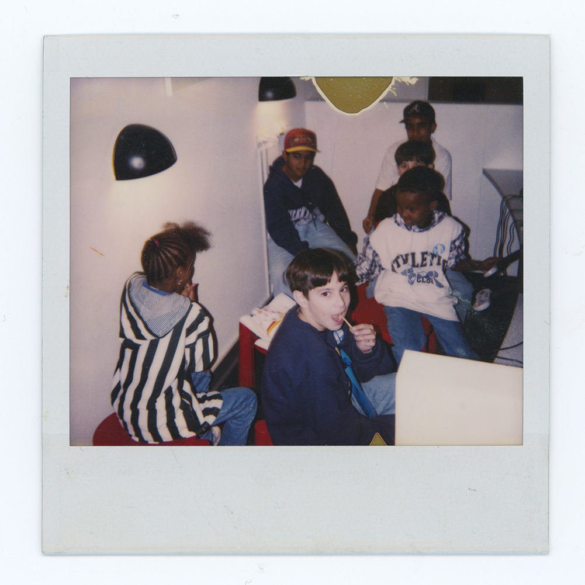

	

		

			<a href="disneyland.html">
				
				 
				Disneyland
			</a>
		

		

			<a href="cereal1.html">
				
				 
				Untitled (Cereal I)
			</a>
		

		

			<a href="cereal2.html">
				
				 
				Untitled (Cereal II)
			</a>
		

		

			<a href="nails.html">
				
				 
				Nails I
			</a>
		

		

			<a href="cereal2.html">
				
				 
				Untitled (Cereal II)
			</a>
		

		

			<a href="cereal2.html">
				
				 
				Untitled (Cereal II)
			</a>
		

		

			<a href="cereal2.html">
				
				 
				Untitled (Cereal II)
			</a>
		

		

			<a href="cereal2.html">
				
				 
				Untitled (Cereal II)
			</a>
		

		

			<a href="cereal2.html">
				
				 
				Untitled (Cereal II)
			</a>
		

	

