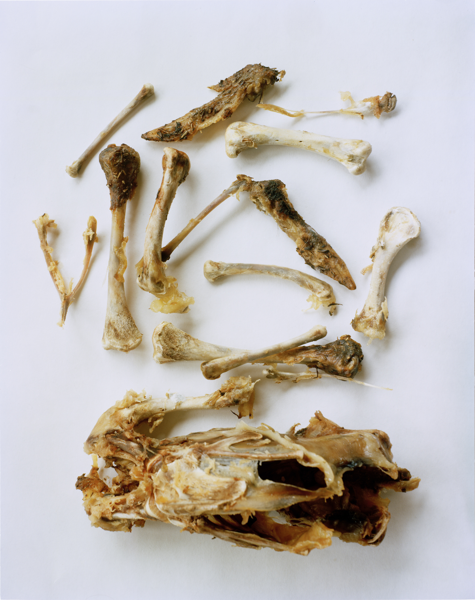
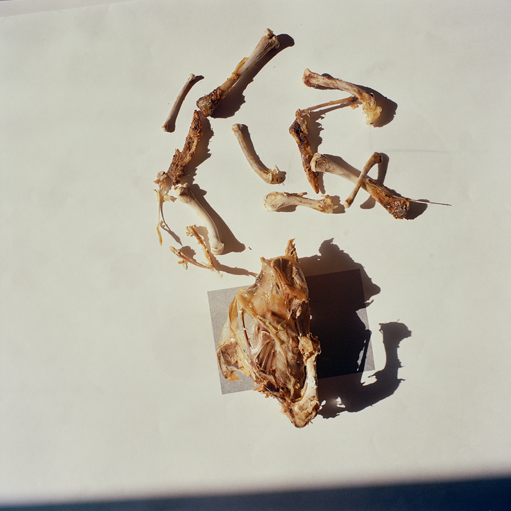
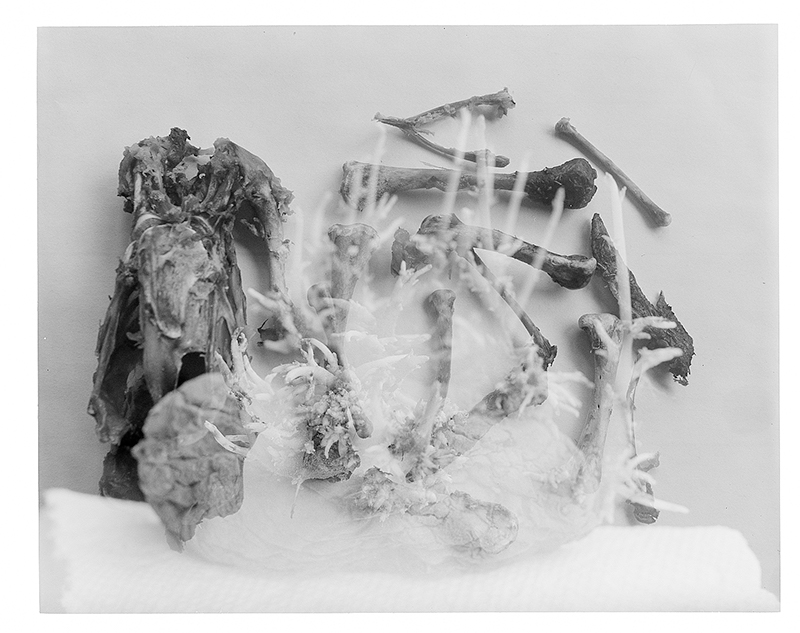
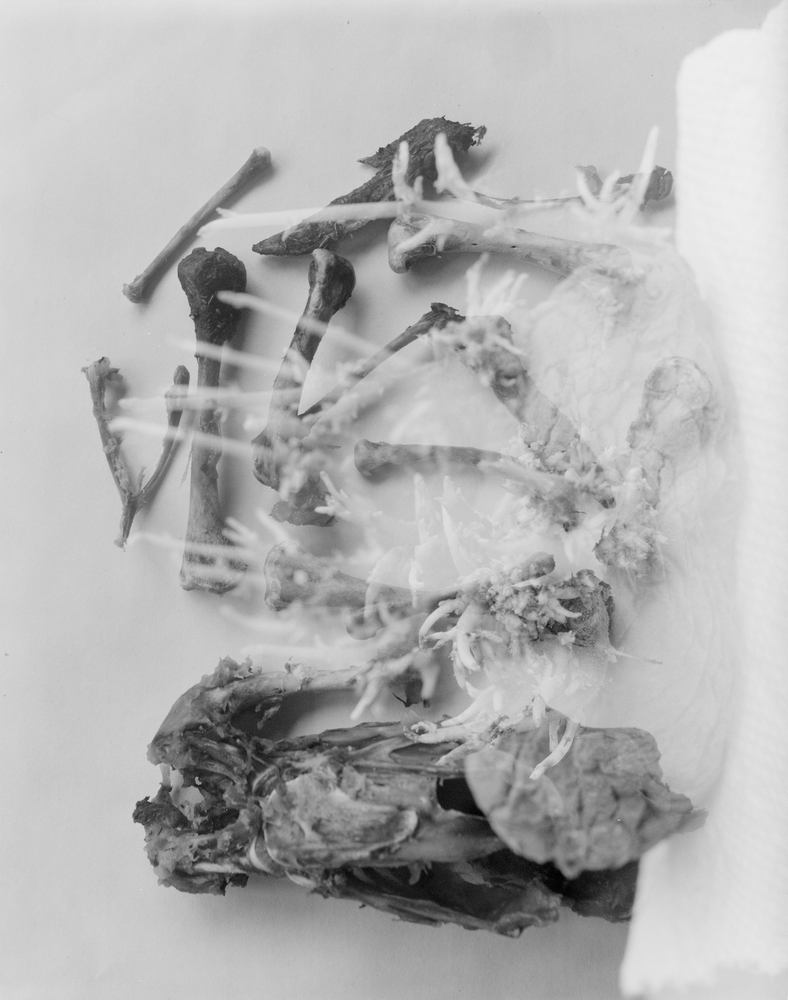
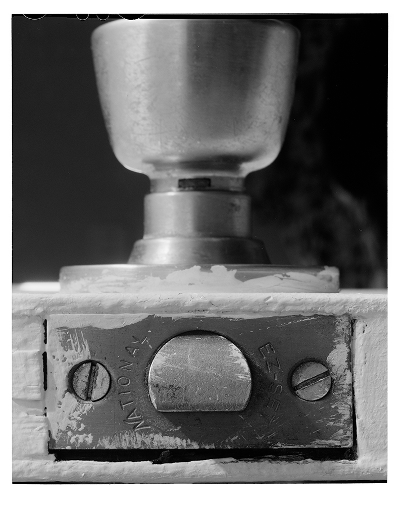
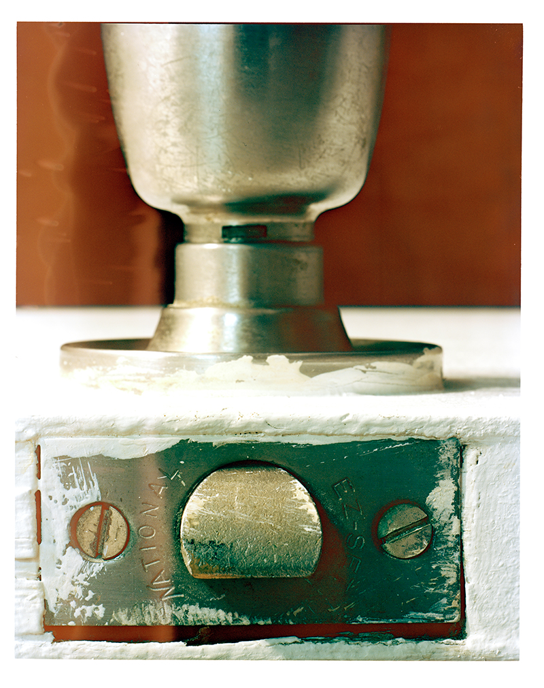
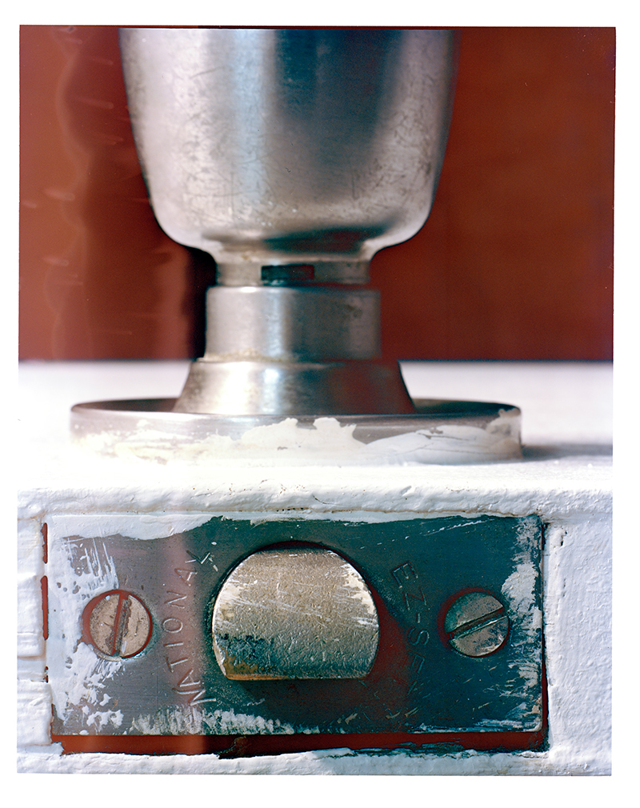
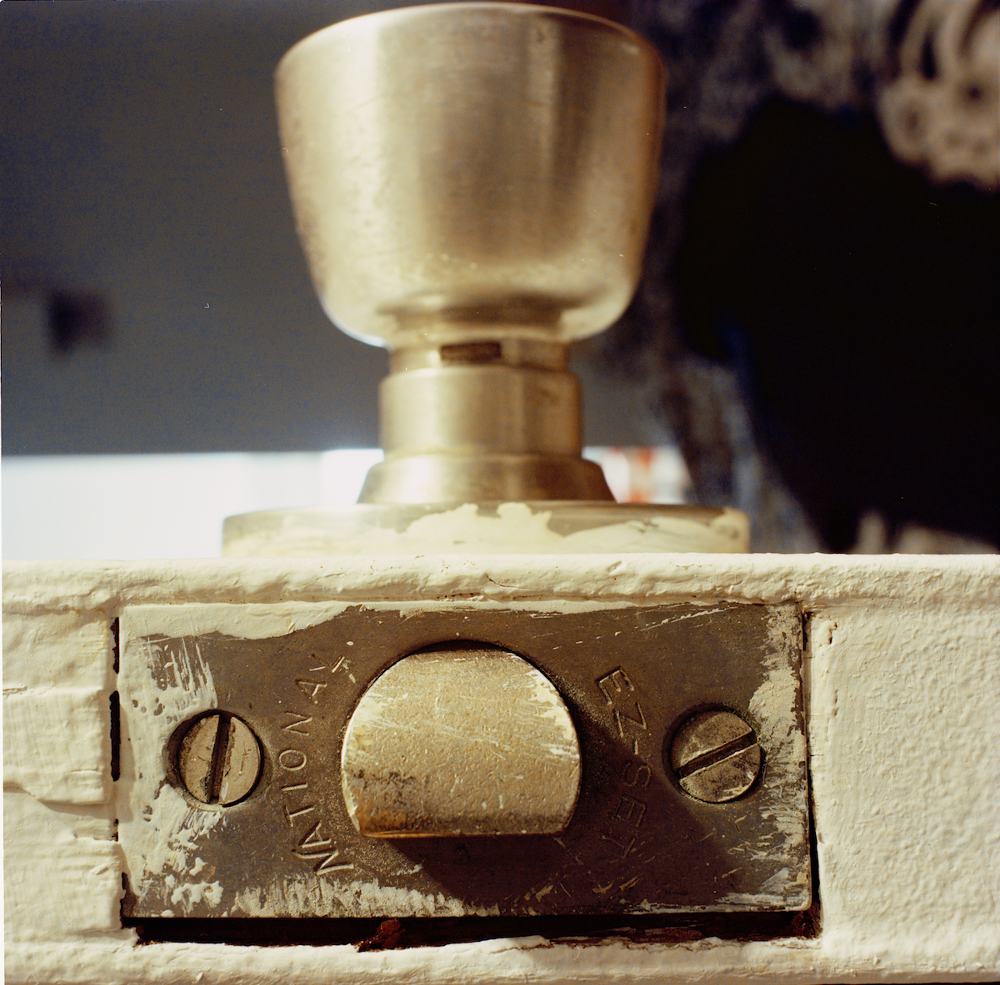
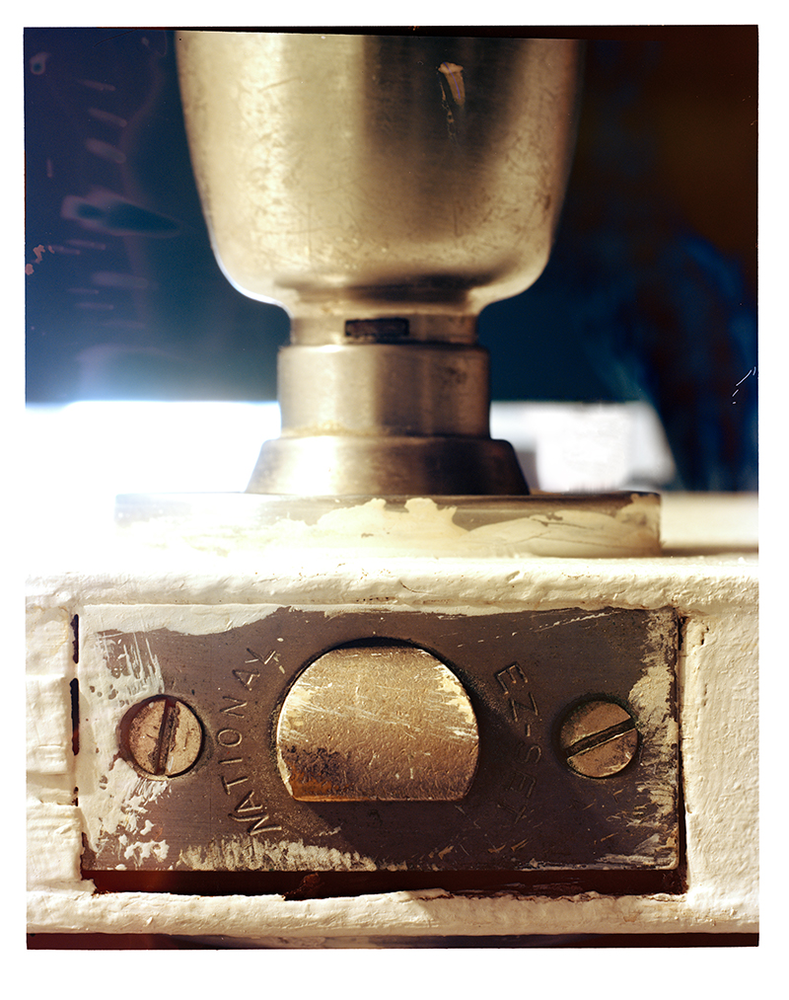

	

		

			
			<h2 class="title">
				<a href="javascript:void(0);">Bones</a>
			</h2>
		

		

			
			<h2 class="title">
				<a href="javascript:void(0);">Bones</a>
			</h2>
		

		

			
			<h2 class="title">
				<a href="javascript:void(0);">Bones</a>
			</h2>
		

		

			
			<h2 class="title">
				<a href="javascript:void(0);">Bones</a>
			</h2>
		

		

			
			<h2 class="title">
				<a href="javascript:void(0);">Bones</a>
			</h2>
		

		

			
			<h2 class="title">
				<a href="javascript:void(0);">Bones</a>
			</h2>
		

		

			
			<h2 class="title">
				<a href="javascript:void(0);">Bones</a>
			</h2>
		

		

			
			<h2 class="title">
				<a href="javascript:void(0);">Bones</a>
			</h2>
		

		

			
			<h2 class="title">
				<a href="javascript:void(0);">Bones</a>
			</h2>
		

		

			
			<h2 class="title">
				<a href="javascript:void(0);">Bones</a>
			</h2>
		

	

	