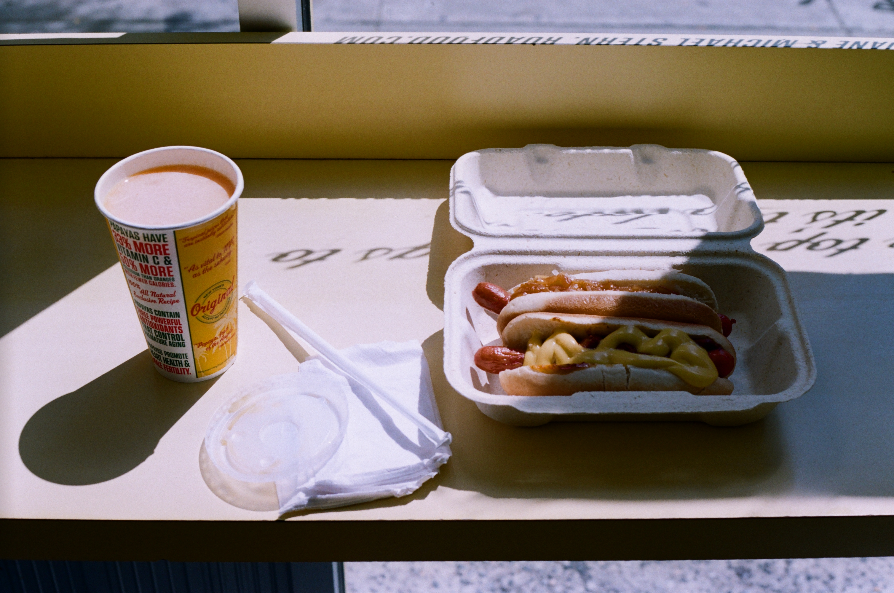

	

		

			
			<h2 class="title">
			<a href="javascript:void(0);" name="#childhood">Papaya King</a>
			</h2>
			

Papaya King, a fast food restaurant located in the Upper East Side, sells hot dogs and juices.
The news reported that the Papaya King would close down soon to be transformed into a highrise building. 
I went to eat a hotdog and get a juice before they close and also take photographs. 
I have a vague memory of Papaya King in the mid 2000s, mostly the neon lights and flurry of colors popping out.
In my mind it was an afterthought but after all these years the memory stuck. 

New York is the hotdog capital of the world, but Papaya King isn't just about a hotdog, it's about New Yorkers.

It wasn't very busy when I arrived but over the next hour business picked up. 
During the lull, I chatted with the workers, all part of a Bangladeshi family, and they told me
"Business has been busy since we were in the news". 

I ordered a sauerkraut dog and a chili and cheese dog with a papaya juice, the recommended staples. 
I put some ketchup and mustard on my dogs and immediately recognized that the ketchup was not Heinz nor Hunts while the mustard wasn’t a cheap yellow but fancy and grainy. 
I like hotdogs, I keep a pack of Nathan’s or Hebrew National in my fridge depending on which one is on sale. 
I ate at the yellow window counter with the August late-noon sun shining in. 
The counter, a tiny glass box, hosts 2 people comfortably but 6 folks were elbow to elbow enjoying their dogs.  
Add the sun to the hot dog terrarium and now it's a hot dog sauna. 
The whole store is a tight space, meant for on-the-go eating. 

The massive windows provide a cinematic view of the corner of 86th Street, one block away from the popular 4-5-6 subway station.  
Two older women in their 60s with thick New York accents checked the prices to get hotdogs later and left.  
The tourists; hungry, confused, curious; walk up to this neon-lit, billboard box nestled among the high rises. 
A crowd of African delivery bikers wait outside for orders to pick up. 
Cars are parked and double parked to order and pick up food.

I finished my meal, went out to the August heat, set up my tripod to get a couple of photographs of the exterior. 
To have no one in the shot I waited close to one hour with the parade of people walking by.

With a think New York accent, a man stopped to ask if I was photographing the shop because I heard the news about the developer.
"That sonovabitch! I've been coming here for 50 years since I was a kid!"

 

A small line started to form; it looked like a Papaya party inside.   
People walked by and I could overhear them -  
"Did you know Papaya King is closing down? Really? Yeah, heard on the news."

A man opens the door and calls to me -  
"Take my photo!"  
"No!" I'm exhausted from the sun.  
He closed the door and went back in.  
I felt I acted brash. I walked up to the window and snapped a photo and walked back to my tripod.  
He later came out to talk to me.  
I need a cold club soda.

I packed up and remembered showing the young employee a Seinfeld clip: Kramer left the movies to fetch a Papaya King dog, a tiny reference that's easy to miss. 
He had not heard of Seinfeld but seemed amused that this dated sitcom referenced his family's business. 

		

	

